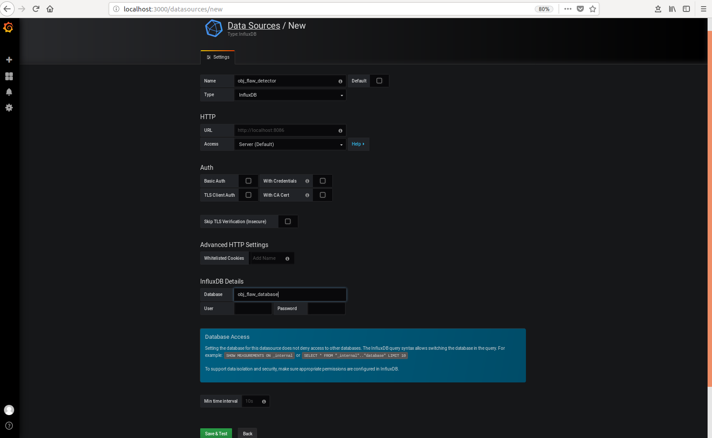
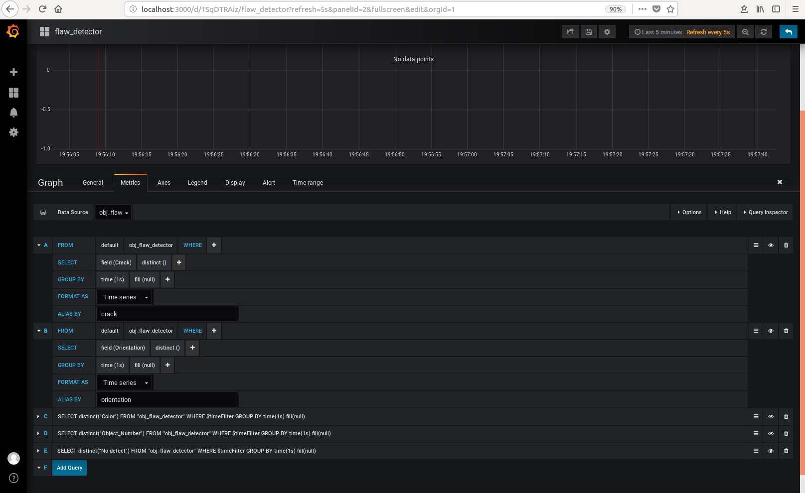
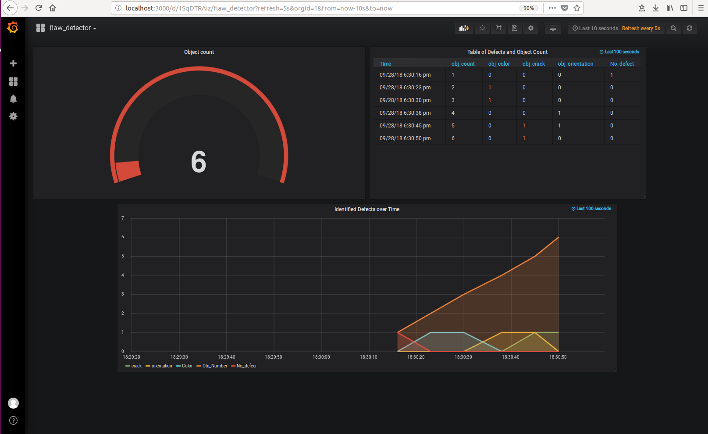

# Object Flaw Detector

| Details            |                 |
|-----------------------|------------------|
| Target OS:            |  Ubuntu 16.04 LTS     |
| Programming Language: |  Python 3.5 |
| Time to complete:     |  30 min      |


## Introduction

This object flaw detector application detects the anomalies present in the objects moving on a conveyor belt. The application identifies the number of objects moving on the conveyor belt and checks for the presence of defects in the color and orientation of the object. The objects are checked for the presence of cracks. The ones containing cracks are marked as defective.

## Requirements

* Ubuntu 16.04
* OpenVINO™ 2018 R3 release toolkit
* Grafana v5.3.2 
* InfluxDB 1.6.2

## Setup


### Install OpenVINO toolkit 
 
Refer to https://software.intel.com/en-us/articles/OpenVINO-Install-Linux for more information on how to install and setup the OpenVINO toolkit


### Install InfluxDB 

Use below commands to install InfluxDB

    sudo apt install curl
	sudo curl -sL https://repos.influxdata.com/influxdb.key | sudo apt-key add - 
  	source /etc/lsb-release
	echo "deb https://repos.influxdata.com/${DISTRIB_ID,,} ${DISTRIB_CODENAME} stable" | sudo tee /etc/apt/sources.list.d/influxdb.list
	sudo apt-get update && sudo apt-get install influxdb
	sudo service influxdb start

### Install Grafana

Use below commands to install Grafana


    wget https://s3-us-west-2.amazonaws.com/grafana-releases/release/grafana_5.3.2_amd64.deb
    sudo apt-get install -y adduser libfontconfig
    sudo dpkg -i grafana_5.3.2_amd64.deb
    sudo /bin/systemctl start grafana-server


### Install Python package dependencies

Run the following command to install required python packages:

    sudo apt-get install python3-pip     
    sudo pip3 install influxdb numpy
 

## How it works

This application takes the input from a video camera or a video file for processing.


**Orientation defect detection:** Get the frame and change the color space to HSV format. Threshold the image based on the color of the object using [inRange](https://docs.opencv.org/3.0-beta/doc/py_tutorials/py_imgproc/py_colorspaces/py_colorspaces.html) function to create a mask. Perform morphological opening and closing on the mask and find the contours using [findContours](https://docs.opencv.org/3.0-beta/doc/py_tutorials/py_imgproc/py_contours/py_contours_begin/py_contours_begin.html) function. Filter the contours based on the area. Perform [PCA](https://docs.opencv.org/3.4.3/d1/dee/tutorial_introduction_to_pca.html) on the contours to get the orientation of the object.


**Color defect detection:** Threshold the image based on the defective color of the object using [inRange](https://docs.opencv.org/3.4.0/da/d97/tutorial_threshold_inRange.html) function. Use the mask obtained from the [inRange](https://docs.opencv.org/3.4.0/da/d97/tutorial_threshold_inRange.html) function to find the defective area.


**Crack detection:** Transform the image from BGR to Grayscale format using [cvtColor](https://docs.opencv.org/3.1.0/de/d25/imgproc_color_conversions.html) function. Blur the image using [blur](https://docs.opencv.org/3.4.2/d4/d13/tutorial_py_filtering.html) function to remove the noises. Use the contours found on the blurred image to detect the cracks


Save the images of defective objects in their respective folders. For example, objects with color defect are saved in **color** folder, objects with cracks are saved in **crack** folder, objects with orientation defect are saved in **orientation** folder and objects with no defect are stored in **no_defect** folder.

## Setting the build environment

To setup OpenVINO environment, update several environment variables to compile and run OpenVINO™ toolkit applications. Run the following script to temporarily set environment variables.

```source /opt/intel/computer_vision_sdk/bin/setupvars.sh -pyver 3.5```

## Running the code 

* Open terminal on Ubuntu

* Go to object flaw detector directory

  ```cd <path_to_object_flaw_detector_code>```

   
  

*  Video input can be given from a file or a camera

    * If using the video input from a file, run the below command
	
         * To save defective images in a specific directory
           
            ```python3.5 flawdetector.py -d <path_to_the_directory_to_dump_defective_images> -f data/object-flaw-detector.mp4```

         * To save defective images in current working directory
         
           ```python3.5 flawdetector.py -f data/object-flaw-detector.mp4```


   * If using a live feed from camera, run the below command

        * To save defective images in a specific directory
        
          ```python3.5 flawdetector.py -d <path_to_the_directory_to_dump_defective_images>```
      
        * To save defective images in current working directory
         
          ```python3.5 flawdetector.py```


* To check the data on InfluxDB, run the following commands
 
    ```influx```

    ```show databases```

    ```use obj_flaw_database```

    ```select * from obj_flaw_detector```

* To visualize data on Grafana, follow below steps.
  1. On the terminal, run the following  command 
    
      ```sudo /bin/systemctl start grafana-server```
  1. Open the browser, go to **localhost:3000**
  2. Log in with user as **admin** and password as **admin**

  3. Click on the **Configuration** icon and  Select **“Data Sources”**
 
  5. Click on **“+ Add data source”** and provide below inputs
  
     * *Name*: Obj_flaw_detector

     * *Type*: InfluxDB
     * *URL*: http://localhost:8086

     * *Database*: obj_flaw_database

     * Click on “Save and Test”

      

  6. To create a new Dashboard
  
     * Select **+** icon from the side menu bar which is under grafana icon and select **Dashboard**

     * Select **Graph**, click on the **Panel Title** and select **Edit**

     * On the **Metrics** tab
     
        1. From **Datasource** choose **obj_flaw_detector**
            
        1. Click on the row just below the tab, starting with **“A”**
        2. Click on **select measurement** and select **obj_flaw_detector** 
        3. From **SELECT** row, click on **fields** and select **Color**. Also click on **+** from the same row, select **aggregations** and click on **distinct()**. From **GROUP BY** row, click on **time** and select **1s**. Name the query as **color** in the **ALIAS BY** row.
        4. Similarly from **Metrics** tab configure for **Crack**, **Orientation**, **No defect** and **Object Number** by clicking **Add Query**
        
     * On the **Time range** tab, change the **override relative time** to **100s**
     
     * Save the dashboard with name **OBJECT FLAW DETECTOR**
        
     

  7.  Click on the **add panel** icon on the top menu
  
      * Select **Table** , Click on the **Panel Title** and select **Edit** and follow the steps mentioned in the previous step for configuring **Metric** and **Time range** tab.
      
      * From the **Column Styles** tab, click on **+Add** and in the **Apply to columns named** give the name **color**, and also value **0** in the **Decimals**.
      
      * Similarly from **Column Styles** tab configure for **Crack**, **Orientation**, **No defect** and **Object Number** by clicking **+Add** 
    
      * Save the dashboard and click on **Back to dashboard** icon which is on right corner of the top menu

  8.  Click on the **add panel** icon on the top menu 
  
      * Select **Singlestat**, Click on the **Panel Title** and select **Edit** 
        1. From **Datasource** choose **obj_flaw_detector** and click on the row just below the tab, starting with **“A”**
        2. Click on **select measurement** and select **obj_flaw_detector** 
        3. From **SELECT** row, click on **fields** and select **Object Number**. Also click on **+** from the same row, select **aggregations** and click on **sum()**. From **GROUP BY** row, click on **time** and select **1s**. Name the query as **Object Count** in the **ALIAS BY** row.

      * On the **Options** tab, select **show** under **Gauge** option  and change the value of **decimals** to **0** under **Value** option

      * Save the dashboard and click on **Back to dashboard** icon . 

  9. Mark the current directory as favourite by clicking on **Mark as favorite** icon on the top menu.

  10.  Select **Time picker** from the top menu of dashboard. Under **Custom range** change the **From** value to **now-10s** and **Refreshing every:** to **5s**, click on **Apply** and save the dashboard.
 
  9. For re-testing, follow the below steps 
     * In a new browser tab or window, go to **http://localhost:3000/** 

     * Log in with user as **admin** and password as **admin**
     
     * The **“Home Dashboard”** shows up the list of starred and Recently viewed dashboards. Select **OBJECT FLAW DETECTOR** 

     

  10. Run the python code again on the terminal to visualize data on grafana
  
       


## (Optional) Saving Data to the Cloud

As an optional step you can take the data results and send these to an Amazon Web Services (AWS)* instance for graphing

1. Make an EC2 Linux* instance on AWS (https://docs.aws.amazon.com/AWSEC2/latest/UserGuide/EC2_GetStarted.html)

2. Install InfluxDB* on EC2 Linux instance (https://github.com/influxdata/influxdb)

3. Install Grafana on EC2 Linux instance (https://grafana.com/get)
