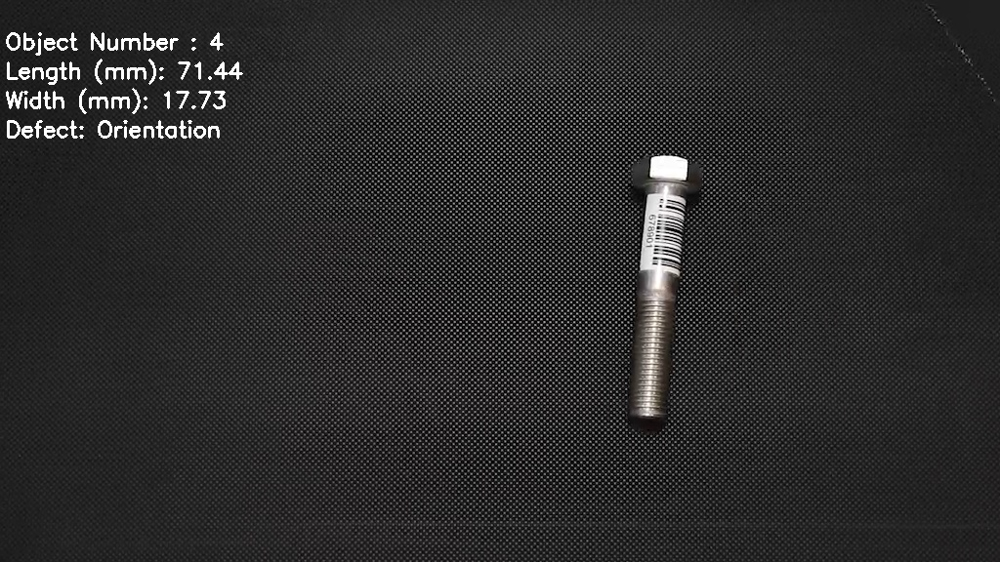
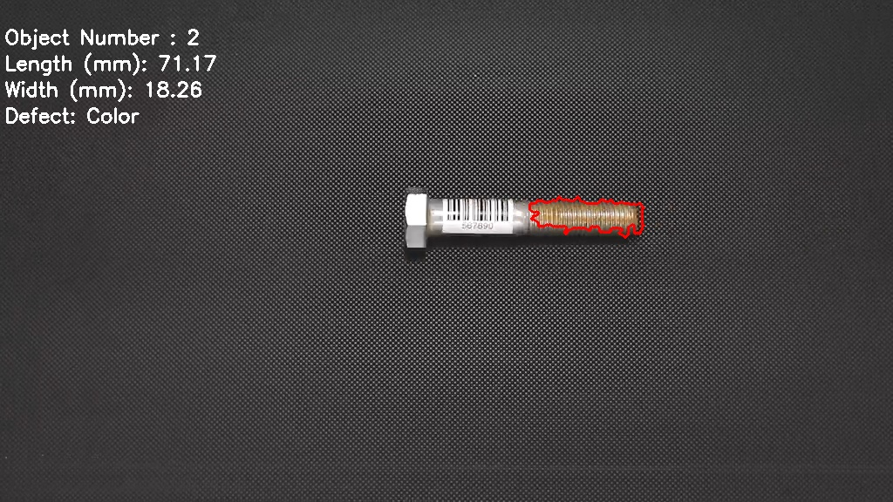
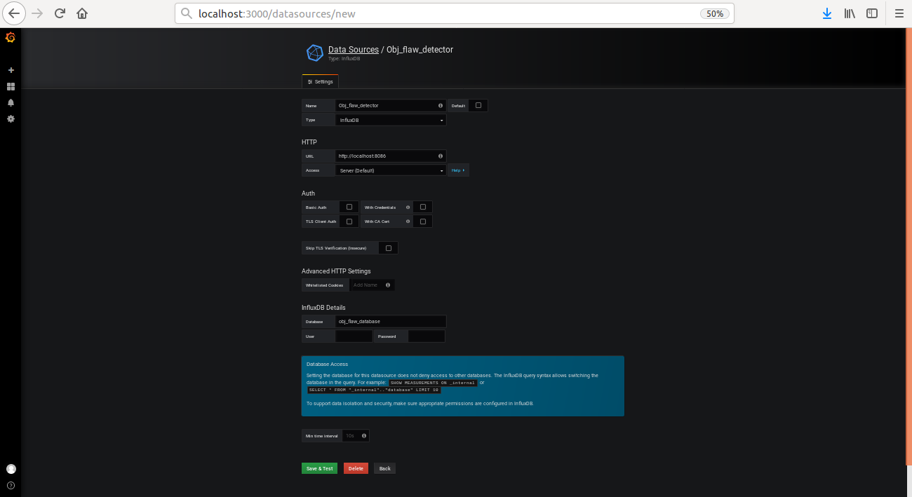
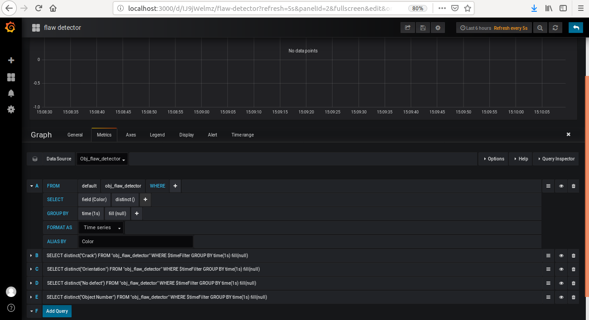
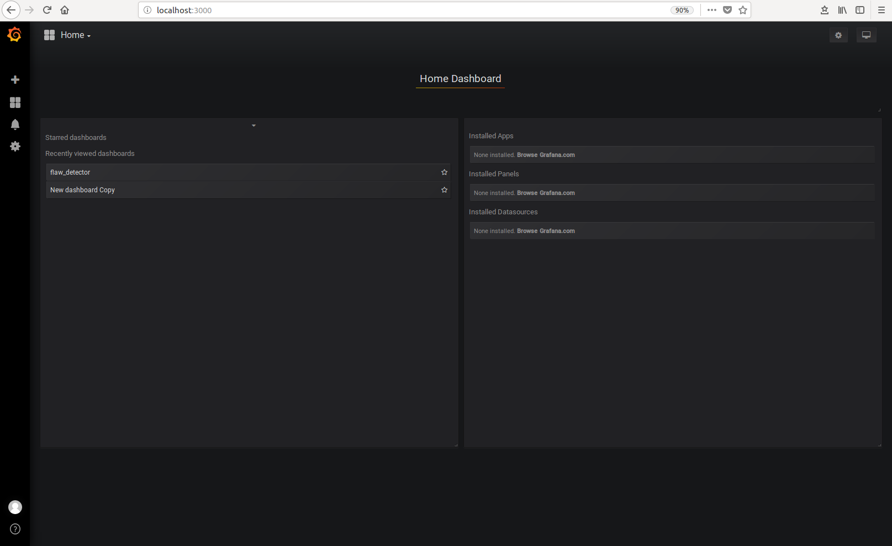

# Object Flaw Detector

| Details               |                   |
| --------------------- | ----------------- |
| Target OS:            | Ubuntu* 16.04 LTS |
| Programming Language: | Python* 3.5       |
| Time to complete:     | 30 min            |

This reference implementation is also [available in C++](https://github.com/intel-iot-devkit/reference-implementation-private/blob/object-flaw-measurement/object-flaw-detector-measurement/README.MD).

## What it does

The object flaw detector application detects the anomalies such as color, crack, and orientation of the object moving on a conveyor belt. Anomalies are marked as defective and saved in the color, crack, orientation folders respectively. Also objects with no defects are saved in no_defect folder.
These anomalies data is sent to InfluxDB* database and is visualized on Grafana*.
This application also measures length and width of the object in millimeters.  

## Requirements

- Ubuntu 16.04
- Intel® Distribution of OpenVINO™ toolkit 2019 R2 Release
- Grafana* v5.3.2 
- InfluxDB* v1.6.2

## Setup

### Install Intel® Distribution of OpenVINO™ toolkit 

Refer to [ Install the Intel® Distribution of OpenVINO™ toolkit for Linux*](https://software.intel.com/en-us/articles/OpenVINO-Install-Linux) for more information on how to install and set up the Intel® Distribution of OpenVINO™ toolkit

## How It works

This application takes the input from a video camera or a video file for processing.


**Orientation defect detection:** Get the frame and change the color space to HSV format. Threshold the image based on the color of the object using [inRange](https://docs.opencv.org/master/df/d9d/tutorial_py_colorspaces.html) function to create a mask. Perform morphological opening and closing on the mask and find the contours using [findContours](https://docs.opencv.org/master/d4/d73/tutorial_py_contours_begin.html) function. Filter the contours based on the area. Perform [PCA](https://docs.opencv.org/master/d1/dee/tutorial_introduction_to_pca.html) (Principal Component Analysis) on the contours to get the orientation of the object.



**Color defect detection:** Threshold the image based on the defective color of the object using  [inRange](https://docs.opencv.org/master/df/d9d/tutorial_py_colorspaces.html) function. Use the mask obtained from the  [inRange](https://docs.opencv.org/master/df/d9d/tutorial_py_colorspaces.html) function to find the defective area.



**Crack detection:** Transform the image from BGR to Grayscale format using [cvtColor](https://docs.opencv.org/master/df/d9d/tutorial_py_colorspaces.html) function. Blur the image using [blur](https://docs.opencv.org/master/d4/d13/tutorial_py_filtering.html) function to remove the noises. Use the contours found on the blurred image to detect the cracks.


Save the images of defective objects in their respective folders. For example, objects with color defect are saved in **color** folder, objects with cracks are saved in **crack** folder, objects with orientation defect are saved in **orientation** folder and objects with no defect are stored in **no_defect** folder.

## Setup

### Get the code

Steps to clone the reference implementation: (object-flaw-detector-python)

    sudo apt-get update && sudo apt-get install git
    git clone https://github.com/intel-iot-devkit/object-flaw-detector-python.git
    
### Install Intel® Distribution of OpenVINO™ toolkit
Before running the application, install the Intel® Distribution of OpenVINO™ toolkit. For details, see [Installing the Intel® Distribution of OpenVINO™ toolkit for Linux*](https://software.intel.com/en-us/openvino-toolkit/choose-download/free-download-linux)

### Other dependencies
#### InfluxDB*
InfluxDB is a time series database designed to handle high write and query loads. It is an integral component of the TICK stack. InfluxDB is meant to be used as a backing store for any use case involving large amounts of timestamped data, including DevOps monitoring, application metrics, IoT sensor data, and real-time analytics.

#### Grafana*
Grafana is an open-source, general purpose dashboard and graph composer, which runs as a web application. It supports Graphite, InfluxDB, Prometheus, Google Stackdriver, AWS CloudWatch, Azure Monitor, Loki, MySQL, PostgreSQL, Microsoft SQL Server, Testdata, Mixed, OpenTSDB and Elasticsearch as backends. Grafana allows you to query, visualize, alert on and understand your metrics no matter where they are stored.

To install the dependencies of the RI, run the below command:
   ```
   cd <path_to_the_object-flaw-detector-python_directory>
   ./setup.sh
   ```
### The Config File

The _resources/config.json_ contains the path to the videos that will be used by the application.
The _config.json_ file is of the form name/value pair, `video: <path/to/video>`   

Example of the _config.json_ file:

```
{

    "inputs": [
	    {
            "video": "videos/video1.mp4"
        }
    ]
}
```

### Which Input video to use

The application works with any input video. Find sample videos for object detection [here](https://github.com/intel-iot-devkit/sample-videos/).  

For first-use, we recommend using the [bolt-detection](https://github.com/intel-iot-devkit/sample-videos/blob/master/bolt-detection.mp4) video.The video is automatically downloaded to the `resources/` folder.
For example: <br>
The config.json would be:

```
{

    "inputs": [
	    {
            "video": "sample-videos/bolt-detection.mp4"
        }
    ]
}
```
To use any other video, specify the path in config.json file

### Using the Camera instead of video

Replace the path/to/video in the _resources/config.json_  file with the camera ID, where the ID is taken from the video device (the number X in /dev/videoX).   

On Ubuntu, list all available video devices with the following command:

```
ls /dev/video*
```

For example, if the output of above command is /dev/video0, then config.json would be::

```
{

    "inputs": [
	    {
            "video": "0"
        }
    ]
}
```

### Setup the Environment

Configure the environment to use the Intel® Distribution of OpenVINO™ toolkit once per session by running the **source** command on the command line:
```
source /opt/intel/openvino/bin/setupvars.sh -pyver 3.5
```
__Note__: This command needs to be executed only once in the terminal where the application will be executed. If the terminal is closed, the command needs to be executed again.

## Run the Application

- Change the current directory to the git-cloned application code location on your system:
  
  ```
  cd <path-to-object-flaw-detector-python>/application
  ```

- To see a list of the help options:

  ```
  python3 object_flaw_detector.py --help
  ``` 

- Input source can be a video file or a camera.

    - To save defective images in a specific directory

      ```
      python3.5 object_flaw_detector.py -dir <path_to_the_directory_to_dump_defective_images>
      ```

    - To save defective images in current working directory

      ```
      python3.5 object_flaw_detector.py
      ```

    **Optional:** If field of view and distance between the object and camera are available use ```-fv```  and ```-dis``` command line arguments respectively. Otherwise camera of 96 pixels per inch is considered by default. For example:

      python3.5 object_flaw_detector.py -f 60 -d 50

     **Note:** User can get field of view from camera specifications. The values for ```-f``` and ```-d``` should be in __degrees__ and __millimeters__ respectively.

- To check the data on InfluxDB, run the following commands:

```
influx
show databases
use obj_flaw_database
select * from obj_flaw_detector
```

### Visualize on Grafana

- If you wish to import settings to visualise the data on Grafana, follow steps below.

  1. On the terminal, run the following command:

     ```
     sudo service grafana-server start
     ```

  2. In your browser, go to localhost:3000.

  3. Log in with user as **admin** and password as **admin**.

  4. Click on **Configuration**.

  5. Select **“Data Sources”**.

  6. Click on **“+ Add data source”** and provide inputs below.

     - *Name*: Obj_flaw_detector
     - *Type*: InfluxDB
     - *URL*: http://localhost:8086
     - *Database*: obj_flaw_database
     - Click on “Save and Test”

  7. Click on **+**  icon present on the left side of the browser, select **import**.

  8. Click on **Upload.json File**.

  9. Select the file name "flaw_detector.json" from object-flaw-detector-python directory.

  10. Click on import.

  11. Run the python code again on the terminal to visualize data on grafana.

- If you wish to start from scratch to visualize data on Grafana, follow the steps below.

  1. On the terminal, run the following command.

     ```
     sudo service grafana-server start
     ```

  2. Open the browser, go to **localhost:3000**.

  3. Log in with user as **admin** and password as **admin**.

  4. Click on the **Configuration** icon and  Select **“Data Sources”**.

  5. Click on **“+ Add data source”** and provide inputs below.

     - *Name*: Obj_flaw_detector
     - *Type*: InfluxDB
     - *URL*: http://localhost:8086
     - *Database*: obj_flaw_database
     - Click on “Save and Test”

      

  6. To create a new Dashboard

     - Select **+** icon from the side menu bar which is under grafana icon and select **Dashboard**.
     - Select **Graph**, click on the **Panel Title** and select **Edit**.
     - On the **Metrics** tab
       1. From **Datasource** choose **obj_flaw_detector**.
       2. Click on the row just below the tab, starting with **“A”**.
       3. Click on **select measurement** and select **obj_flaw_detector**.
       4. From **SELECT** row, click on **fields** and select **Color**. Also click on **+** from the same row, select **aggregations** and click on **distinct()**. From **GROUP BY** row, click on **time** and select **1s**. Name the query as **color** in the **ALIAS BY** row.
       5. Similarly from **Metrics** tab configure for **Crack**, **Orientation**, **No defect** and **Object Number** by clicking **Add Query**.
     - On the **Time range** tab, change the **override relative time** to **100s**.
     - Save the dashboard with name **flaw_detector**.

     

  7. Click on the **add panel** icon on the top menu.

     - Select **Table** , Click on the **Panel Title** and select **Edit** and follow the steps mentioned in the previous step for configuring **Metric** and **Time range** tab.
     - From the **Column Styles** tab, click on **+Add** and in the **Apply to columns named** give the name **color**, and also value **0** in the **Decimals**.
     - Similarly from **Column Styles** tab configure for **Crack**, **Orientation**, **No defect** and **Object Number** by clicking **+Add**.
     - Save the dashboard and click on **Back to dashboard** icon which is on right corner of the top menu.

  8. Click on the **add panel** icon on the top menu. 

     - Select **Singlestat**, Click on the **Panel Title** and select **Edit**. 
       1. From **Datasource** choose **obj_flaw_detector** and click on the row just below the tab, starting with **“A”**.
       2. Click on **select measurement** and select **obj_flaw_detector**. 
       3. From **SELECT** row, click on **fields** and select **Object Number**. Also click on **+** from the same row, select **aggregations** and click on **sum()**. From **GROUP BY** row, click on **time** and select **1s**. Name the query as **Object Count** in the **ALIAS BY** row.
     - On the **Options** tab, select **show** under **Gauge** option  and change the value of **decimals** to **0** under **Value** option.
     - Save the dashboard and click on **Back to dashboard** icon. 

  9. Mark the current directory as favourite by clicking on **Mark as favorite** icon on the top menu.

  10. Select **Time picker** from the top menu of dashboard. Under **Custom range** change the **From** value to **now-10s** and **Refreshing every:** to **5s**, click on **Apply** and save the dashboard.

  11. For re-testing, follow the steps below:

      - In a new browser tab or window, go to **http://localhost:3000/**. 
      - Log in with user as **admin** and password as **admin**.
      - The **“Home Dashboard”** shows up the list of starred and Recently viewed dashboards. Select **flaw_detector**. 

      

  12. Run the Python code again on the terminal to visualize data on Grafana.

       

## (Optional) Save Data to the Cloud

As an optional step, send data results to an Amazon Web Services (AWS)* instance for graphing.

1. Make an EC2 Linux* instance on AWS. Steps are found [here](https://docs.aws.amazon.com/AWSEC2/latest/UserGuide/EC2_GetStarted.html).
2. Install InfluxDB on EC2 Linux instance. Download [here](https://github.com/influxdata/influxdb).
3. Download and install Grafana on EC2 Linux instance.  Download [here](https://grafana.com/get).
